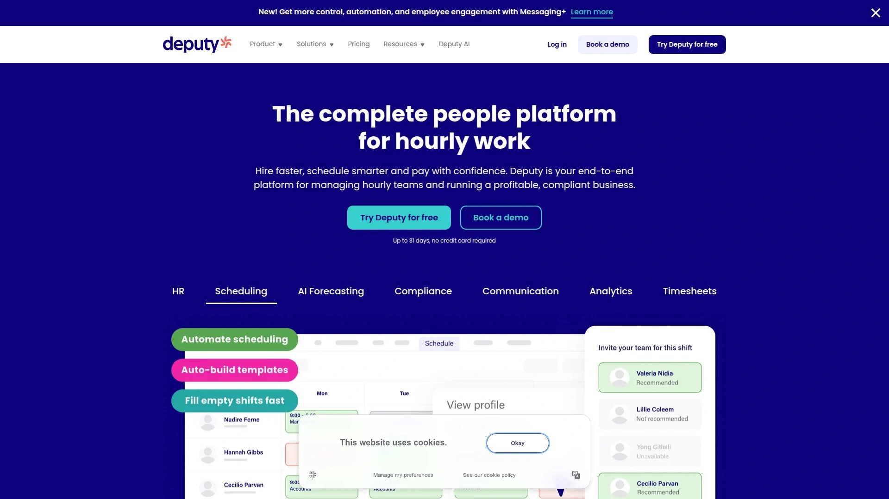
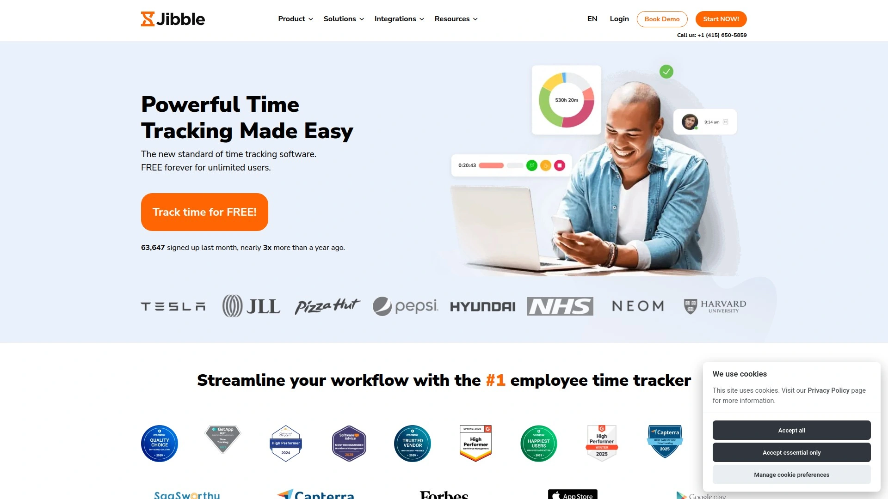

# Top 10 Best Time Tracking Tools in 2025 (Comprehensive Review)

In a world where a few minutes can massively swing the productivity pendulum, picking the right time tracking software feels less like shopping and more like finding a soulmate for your workflow. If your current system is eating away time with clunky manual input, impossible payroll calculations, or employees clocking in from Mars, maybe it’s time to switch things up. Here’s the rundown: ten platforms that fix standard headaches like scheduling, payroll integration, and field management, making team coordination actually enjoyable, and work more controllable—even if you’re flying solo or running a crew in five different zip codes.

***

## Introduction

Let’s face it—relying on old-school timesheet spreadsheets or trusting everyone’s memory is like betting on a coin flip. Modern *time tracking software* lets you automate attendance, handle paid and unpaid leave, monitor remote workers, and integrate with payroll—helping businesses reclaim hours, tighten up coverage, and dodge payroll errors. Tools like these don’t just save time; they slice operational costs and bring calm to frantic workdays.

This guide was crafted to highlight time tracking’s biggest pain points (confusing payroll, unreliable schedules, ambiguous labor costs) and show which platforms bring you peace, control, and cost-efficient results. Whether you run a cleaning crew, a warehouse, or remote marketing ninjas, one of these picks will make managers, admins, and HR sleep easier.

***

## **[Buddy Punch](https://buddypunch.com)**

Simple, powerful time clock software for small businesses and shift-based teams—made to streamline attendance, organize payroll, and manage employee scheduling.

Buddy Punch stands out because it covers every possible work scenario. Employees punch in with QR codes, facial recognition, and geofencing (so no one can clock in from their couch) while managers get customizable reporting and instant payroll integration with giants like QuickBooks, ADP, and Gusto. Shift scheduling, PTO management, and location monitoring are all built in, making it ideal for fleets, franchises, or retail with multiple locations. If labor costs or remote supervision are your nemesis, Buddy Punch is your solution.

Features:

- Customizable time clock options for remote, onsite, and multi-location teams
- Geofencing, GPS, and device locking for secure punch-ins
- Instant payroll and attendance reporting
- Automated overtime and PTO calculations
- Easy onboarding, great customer support

***

## **[Connecteam](https://connecteam.com)**

All-in-one mobile productivity platform for deskless teams—think: cleaning, security, retail, healthcare, field services, and transport.

Connecteam is built for those who want every workplace function in one app: time tracking, shift scheduling, team messaging, training materials, HR docs, and real-time analytics. Businesses use Connecteam to reduce payroll mistakes, keep everyone connected, and cut software costs (by not juggling ten apps for one job). Real-time team visibility and automated documentation make it perfect for large offices or remote teams wanting less confusion and more engagement.

Features:

- Mobile-first design (ideal for field staff)
- Time clock, shift scheduling, and task/project assignment
- Integrated team communication and document management
- In-app training and onboarding
- 5-minute support response times, easy integration with payroll apps

***

## **[Deputy](https://www.deputy.com)**

Dynamic scheduling and time tracking for businesses needing labor compliance, shift-work efficiency, and clear communications.

Deputy nails workforce management with drag-and-drop scheduling, auto-scheduler powered by AI, biometric and location-based punch-ins, and leave/certification tracking for shift coverage. It integrates with payroll, POS, and HR platforms, so businesses can manage everything from compliance (breaks, overtime) to detailed reporting. Deputy is especially strong for companies split across multiple locations or strict labor laws.

Features:

- Touchless clock-in with facial recognition, GPS, and PINs
- AI-powered auto-scheduler
- Newsfeed announcements and task management
- Digital timesheets, leave, and compliance tools

***

## **[TimeCamp](https://www.timecamp.com)**

Automatic time tracking and project/accounting management for solo pros or large teams.

TimeCamp offers hands-free time tracking by categorizing app and website use, then linking time entries to projects or clients. Its desktop, web, and mobile apps support both automatic and manual entry, ensuring no time slips through the cracks—even for multitaskers. TimeCamp handles reporting, billing, invoicing, attendance, and integrates payroll, making it a great catch for organizations wanting accuracy without micromanagement.

Features:

- Automatic project tracking and productivity analysis
- Invoicing, payroll, attendance, and leave tracking
- Multi-platform support (desktop, mobile, browser plugins)
- Integration with PM and accounting software

***

## **[Clockify](https://clockify.me)**

Flexible, user-friendly time tracker for freelancers and teams needing customizable hours and detailed project reports.

Clockify is praised for its straightforward clock-in/out system and robust reporting that fits businesses of any size. GPS-enabled time tracking, notifications, and integrations with popular PM and payroll tools ensure you never miss a beat. The free version comes with a lot; paid plans suit bigger teams.

Features:

- Mobile, desktop, and browser support
- GPS, task tagging, project rates
- Export data, team chat, and pay rate setup

***

## **[Jibble](https://jibble.io)**

Free and full-featured time tracker for teams who want mobile clock-ins, real-time syncing, and timesheet exports.

Jibble is perfect for remote teams thanks to facial recognition, geofencing, and simple setup. Notifications help reduce missed punches, and its mobile-first design keeps things accessible. Clean, exportable reports make it ideal for teams wanting robust performance metrics and attendance insights.

Features:

- Full spectrum of tracking on free plan (GPS, timesheets, facial recognition)
- Real-time sync across devices
- Customizable tracking policies for flexible or strict teams

***

## **[Paymo](https://www.paymoapp.com)**

Project management and time tracking platform for small agencies and remote teams—spotlight on productivity.

Paymo combines automatic time tracking with project, invoicing, and team coordination. Managers can monitor profitability, keep everyone on tasks, and export reports for client billing. Its Pomodoro timers, privacy controls, and multiple platforms make it stress-free for both managers and team members.

Features:

- Task-centric time tracking and budgeting
- Multiple tracking modes (manual, automatic, Pomodoro)
- Privacy controls, bulk edit, team dashboards

***

## **[Hubstaff](https://hubstaff.com)**

Intense monitoring and productivity analytics for businesses needing deep oversight of remote teams.

Hubstaff goes the extra mile with screenshots, URL/app tracking, attendance metrics, and project profitability insights. It runs on nearly every platform (web, desktop, mobile, Chrome) and is aimed at teams where close tracking is essential.

Features:

- Productivity analytics, keystroke/mouse tracking
- GPS/geofence support for field teams
- Payroll, invoicing, and integrations

***

## **[QuickBooks Time](https://quickbooks.intuit.com/time-tracking/)**

Payroll-driven time tracker for businesses needing seamless integration with accounting, jobs, and GPS.

QuickBooks Time delivers AI-powered time management, job costing, GPS, and direct link to payroll. Multi-platform support ensures that both field and office staff are tracked reliably.

Features:

- GPS tracking, job codes, alerts, pay rate setup
- Full accounting integration for payroll and invoicing

***

## **[BusyBusy](https://busybusy.com)**

Field employee time tracking with GPS, photos, and supervisor tools for project-based businesses.

BusyBusy is designed for construction and field teams, letting supervisors group-punch whole crews, attach project codes, and track locations in real time. Schedules, budgets, and liability photos keep projects on track and payroll accurate.

Features:

- Multiple log-in modes (employee, supervisor, owner)
- GPS and photo tracking, project codes, scheduling
- Easy mobile and web access, budget comparison charts

***

# FAQ

**Q: How do I get started with time tracking for a remote team?**
A: Most platforms offer free trials, mobile apps, and simple onboarding. Look for mobile-first design, GPS tracking, and exportable reports for best results.

**Q: Can time tracking software automatically calculate overtime and breaks?**
A: Yes, nearly all top tools have built-in calculations for overtime, break compliance, and pay rates—no manual number crunching required.

**Q: Are these tools suitable for field or multi-location staff?**
A: Definitely. Features like geofencing, device locks, and real-time reporting are made for teams who aren’t at a desk all day.

***

# Conclusion

Time tracking shouldn’t be another headache—it should just work, no matter what kind of team you’re running. For small and mid-sized organizations, **Buddy Punch** is the go-to for smart scheduling, payroll reporting, and multi-location coordination. If you want mobile-first control over every aspect of team management, hit up [Buddy Punch](https://buddypunch.com) and start testing efficiency on autopilot. When you need a platform that brings everything into one simple dashboard, this is the one to click.

Why #1 is suitable for businesses juggling remote, shift-based, or multi-location teams: [Buddy Punch](https://buddypunch.com) covers every work scenario, brings secure, automated tracking, and keeps payroll precise—so you spend more time growing and less time worrying.
